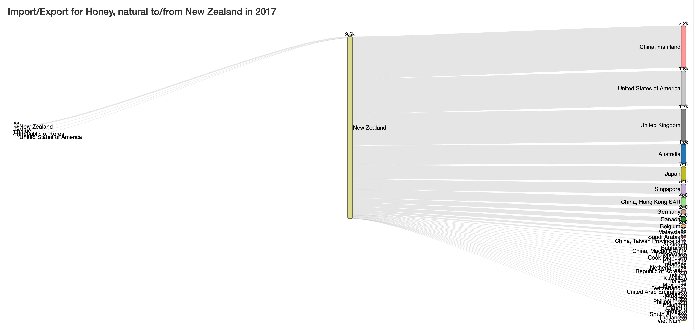
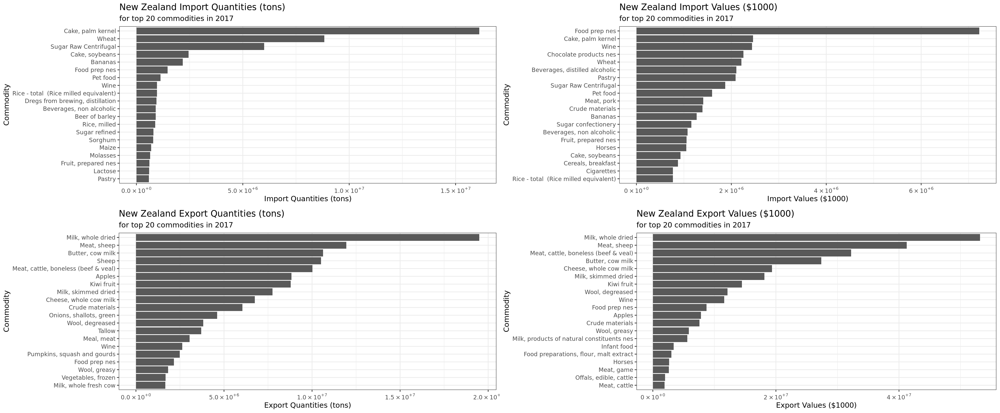

# ~honey~world trade

The data come from the FAO trade matrix. This is a relatively large database ~6GB which is stored in sqlite. `data_load.R` downloads and prepares the data and indexes for the application. You need about 10GB free to run this operation. When complete it will take about 6.2GB. Further normalization of the underlying table could bring the total DB size down quite a bit.  

Using FAO's trade matrix data to better understand the international trade in food and food-related commoditites worldwide. Select a commodity and country to see the flows. Change between Value ($) and Quantity (metric tons) to see how these vary. 

# Dependecies 

* R dependecies handled by `renv`
* Running `data_load.R` depends on your system having a working copy of `iconv` to convert to UTF-8 character set as data from FAO are not encoded as UTF-8
  * Mac: `brew install libiconv`
  * Linux: `apt install libiconv`  

## Sankey Diagram

## Top Commodities

